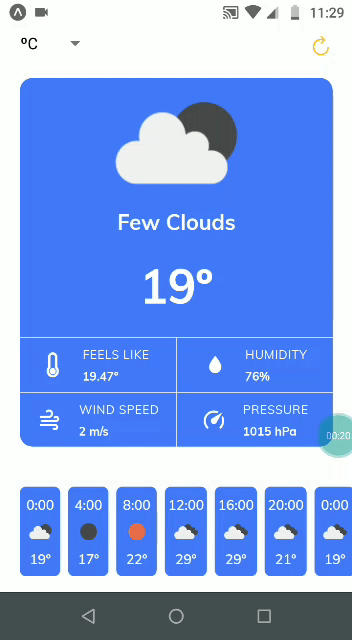

<h1 align="center">
    
    <br>
 
</h1>
<p align="center">
  <a href="#sobre"> </a>
  <a href="#license"> </a>
</p>
<br>
<br>
<h2>✨ Preview</h2>
<div align="center">

</div>
<br> <br>
<h2 id="sobre">🔎 Sobre o Projeto</h2>
<b>Aplicação React Native / Expo</b> desenvolvidada para apresentar dados meteorológicos ao usuário. Os dados são providos pela API <a href="https://openweathermap.org/api/one-call-api">One Call</a>, da Open Weather.
<br> 
<h3>📱Principais features</h3>

```
➙ Localização do usuário
➙ Suporte a idiomas com base nas configurações do usuário
➙ Dados apresentados em duas unidades de medida
➙ Layout adaptativo (Android / IOS)
```

<h2 id="tecnologias">⚙️ Tecnologias utilizadas</h2>
➙ Figma <br>
➙ React Native / Expo
<h2>📍Bibliotecas adicionais</h2>
➙ React Native Picker <br>
➙ Expo App Loading <br>
➙ Expo Localization / i18n-js<br>
➙ Expo Location<br>
➙ React Native Extended StyleSheet


<h2>💡Rode na sua máquina</h2>

```
# Clone este repositório
$ git clone https://github.com/diegomagalhaes-dev/weather_now

# Instale as dependências
$ yarn 

# Gere uma key na Open Weather:
https://openweathermap.org/

# Preencha o sua key em 'WEATHER_API_KEY', dentro do arquivo Deshboard.js na pasta Screens


# Inicie a aplicação
$ expo start

# (necessário ter o Node, Expo, Yarn e o Git instalados na sua máquina)
```

<h2 id="license"> :memo: Licença</h2>

Esse projeto está sob  a Licença MIT. Acesse [LICENSE](https://github.com/diegomagalhaes-dev/crypto-daily/blob/master/LICENSE) para mais informações.
<hr>
Feito com ♥ por Diêgo Magalhães :wave: <br><a href="https://www.linkedin.com/in/magalhaesdiego/">Fale comigo! 😄</a>
